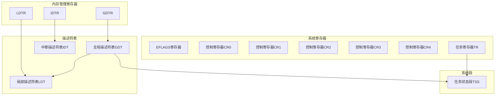
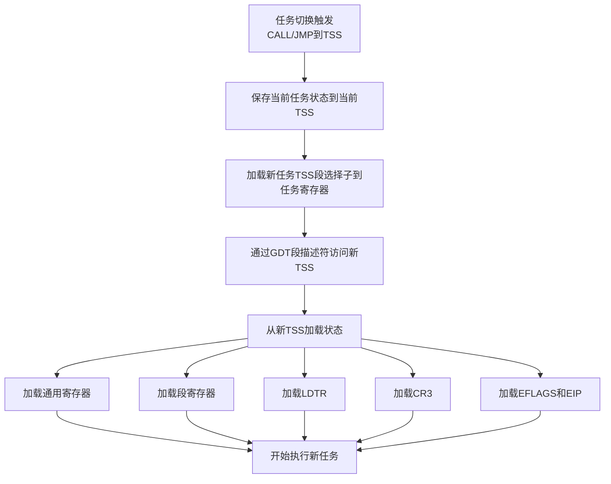
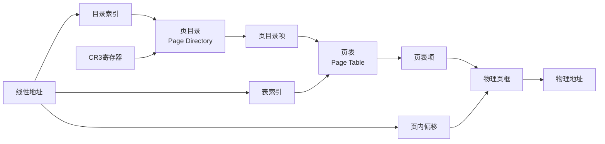
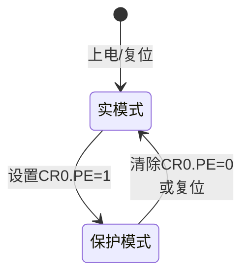
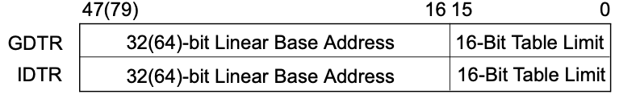

# x86系统架构概览 - 读书笔记

## 1.1 系统级体系结构概览

### 1.1.1 系统架构总体结构（参照图2.1）

IA-32系统级架构由一组寄存器、数据结构和指令组成，用于支持内存管理、中断和异常处理、任务管理以及多处理器控制等基本系统级操作。



### 1.1.2 全局描述符表（GDT）和局部描述符表（LDT）

**功能：**
- 在保护模式下，所有内存访问都通过GDT或LDT进行
- GDT和LDT包含段描述符（Segment Descriptors）
- 每个段描述符提供段的基址、段界限、访问权限、类型和使用信息

**段选择子（Segment Selector）：**
- 提供GDT或LDT的索引（偏移量）
- 全局/局部标志（TI位）：确定选择子指向GDT还是LDT
- 访问权限信息（RPL）

**访问机制：**


**寄存器：**
- **GDTR**：保存GDT的线性基址（32位）和16位表界限
- **LDTR**：保存LDT的16位段选择子、基址（32位）、段界限和描述符属性

### 1.1.3 系统段、段描述符和门

**系统段类型：**
1. **任务状态段（TSS）** - 保存任务状态信息
2. **局部描述符表（LDT）** - 每个任务可以有自己的LDT

**门描述符类型：**
- **调用门（Call Gates）** - 提供对不同特权级代码段的保护访问
- **中断门（Interrupt Gates）** - 用于中断处理
- **陷阱门（Trap Gates）** - 用于异常处理
- **任务门（Task Gates）** - 用于任务切换

**调用门机制：**
调用门提供对可能运行在不同特权级的系统过程和处理程序的保护访问。通过调用门访问过程时：
1. 调用过程提供调用门的选择子
2. 处理器执行访问权限检查：比较CPL与调用门特权级和目标代码段特权级
3. 如果允许访问，处理器从调用门获取目标代码段的段选择子和偏移量
4. 如果需要特权级变化，处理器切换到目标特权级的堆栈

### 1.1.4 任务状态段（TSS）和任务门

**TSS内容：**
- 通用寄存器状态
- 段寄存器（ES、CS、SS、DS、FS、GS）
- EFLAGS寄存器
- EIP寄存器
- 三个堆栈段的段选择子和堆栈指针（特权级0、1、2各一个）
- 与任务关联的LDT段选择子
- 页目录基址（CR3寄存器）

**任务切换过程：**


**任务寄存器（TR）：**
- 保存当前任务TSS的16位段选择子
- 自动保存TSS的基址、段界限和描述符属性
- 上电或复位后基址=0，界限=0FFFFH

### 1.1.5 中断和异常处理

**中断描述符表（IDT）：**
- 存储门描述符集合，提供对中断和异常处理程序的访问
- 不是段，线性基址保存在IDTR寄存器中

**中断/异常处理流程：**


**中断向量来源：**
- 内部硬件
- 外部中断控制器
- 软件（INT、INTO、INT3、BOUND指令）

**IDTR寄存器：**
- 保存IDT的线性基址（32位）和16位表界限
- 上电或复位后基址=0，界限=0FFFFH

### 1.1.6 内存管理

**地址转换机制：**

系统架构支持直接物理寻址或通过分页的虚拟内存。

**分页机制：**


**CR3寄存器：**
- 包含页目录基址的物理地址
- PCD和PWT标志控制页结构的缓存方式
- 低12位假定为0（页对齐）

**分页结构：**
- **页目录**：包含页目录项，指向页表
- **页表**：包含页表项，指向物理页框
- 页表项包含：物理页基址、访问权限、内存管理信息

### 1.1.7 系统寄存器

系统架构提供系统标志和多个系统寄存器：

**EFLAGS寄存器中的系统标志：**
- 控制任务和模式切换
- 控制中断处理
- 控制指令跟踪
- 控制访问权限

**控制寄存器：**
- **CR0, CR2, CR3, CR4**：包含控制系统级操作的标志和数据
- 这些标志用于指示操作系统对特定处理器功能的支持

## 1.2 实模式和保护模式转换

### 1.2.1 处理器操作模式

**实模式（Real-Address Mode）：**
- Intel 8086处理器的编程环境
- 可以切换到保护模式或系统管理模式

**保护模式（Protected Mode）：**
- 处理器的原生操作模式
- 提供丰富的架构特性、灵活性、高性能

**模式转换图：**


### 1.2.2 实模式到保护模式的转换

**转换步骤：**

1. **准备GDT**
   - 在内存中创建全局描述符表
   - 至少包含一个空描述符和代码、数据段描述符

2. **加载GDTR**
   - 使用LGDT指令加载GDT的基址和界限

3. **准备IDT（可选）**
   - 创建中断描述符表
   - 使用LIDT指令加载

4. **设置CR0.PE位**
   - 通过MOV指令设置CR0寄存器的PE标志（bit 0）
   ```
   MOV EAX, CR0
   OR  EAX, 1      ; 设置PE位
   MOV CR0, EAX
   ```

5. **执行远跳转或远调用**
   - 刷新指令流水线
   - 加载代码段选择子
   ```
   JMP far_pointer  ; 远跳转到保护模式代码
   ```

**关键寄存器：**
- **CR0.PE（Protection Enable，bit 0）**：控制实模式和保护模式的切换

### 1.2.3 保护模式到实模式的转换

**转换步骤：**
1. 禁用中断
2. 如果启用了分页，清除CR0.PG位
3. 转移到16位代码段
4. 清除CR0.PE位
5. 执行远跳转到实模式代码
6. 加载实模式的段寄存器
7. 启用中断（如果需要）

## 1.3 80x86系统指令寄存器

### 1.3.1 标志寄存器EFLAGS

**EFLAGS寄存器结构：**

| 位 | 名称 | 类型 | 说明 |
|----|------|------|------|
| 0 | CF | 状态 | 进位标志 |
| 2 | PF | 状态 | 奇偶标志 |
| 4 | AF | 状态 | 辅助进位标志 |
| 6 | ZF | 状态 | 零标志 |
| 7 | SF | 状态 | 符号标志 |
| **8** | **TF** | **系统** | **陷阱标志（单步调试）** |
| **9** | **IF** | **系统** | **中断使能标志** |
| 10 | DF | 控制 | 方向标志 |
| 11 | OF | 状态 | 溢出标志 |
| **12-13** | **IOPL** | **系统** | **I/O特权级** |
| **14** | **NT** | **系统** | **嵌套任务标志** |
| **16** | **RF** | **系统** | **恢复标志** |
| **17** | **VM** | **系统** | **虚拟8086模式** |
| **18** | **AC** | **系统** | **对齐检查** |
| **19** | **VIF** | **系统** | **虚拟中断标志** |
| **20** | **VIP** | **系统** | **虚拟中断挂起** |
| **21** | **ID** | **系统** | **ID标志** |

**系统标志详解：**

**TF（Trap Flag，bit 8）**
- 设置后启用单步调试模式
- 清除后禁用单步模式
- 单步模式下，每条指令执行后产生调试异常

**IF（Interrupt Enable，bit 9）**
- 控制对可屏蔽硬件中断的响应
- 设置：响应可屏蔽硬件中断
- 清除：禁止可屏蔽硬件中断
- 不影响异常或NMI中断的产生

**IOPL（I/O Privilege Level，bits 12-13）**
- 指示当前运行程序或任务的I/O特权级
- 当前程序的CPL必须≤IOPL才能访问I/O地址空间
- 只有在CPL=0时，POPF和IRET指令才能修改此字段

**NT（Nested Task，bit 14）**
- 控制中断和调用任务的链接
- 通过CALL指令、中断或异常发起的任务调用时，处理器设置此标志
- IRET返回时检查并修改此标志

**RF（Resume Flag，bit 16）**
- 控制处理器对指令断点条件的响应
- 设置时：暂时禁止指令断点产生的调试异常
- 清除时：指令断点产生调试异常

**VM（Virtual-8086 Mode，bit 17）**
- 设置：启用虚拟8086模式
- 清除：返回保护模式

**AC（Alignment Check，bit 18）**
- 与CR0的AM标志配合使用，启用对齐检查
- 只在用户模式（特权级3）执行对齐检查

### 1.3.2 内存管理寄存器

**GDTR（全局描述符表寄存器）**

结构：



- **基址**：GDT在线性地址空间的起始地址（字节0）
- **界限**：GDT中的字节数
- **指令**：
  - LGDT：从内存加载GDT基址和界限到GDTR
  - SGDT：存储GDTR的基址和界限到内存
- **初始化**：上电或复位后，基址=0，界限=0FFFFH

**LDTR（局部描述符表寄存器）**

结构：

![[Pasted image 20251201145545.png]]

- **段选择子**：LDT在GDT中的段选择子
- **基址**：LDT段在线性地址空间的起始地址
- **段界限**：LDT段的字节数
- **属性**：从LDT描述符自动加载
- **指令**：
  - LLDT：加载LDT段选择子到LDTR（基址、界限、属性自动从GDT加载）
  - SLDT：存储LDTR的段选择子到内存或寄存器
- **初始化**：上电或复位后，选择子和基址=0，界限=0FFFFH
- **任务切换**：LDTR自动加载新任务的LDT

**IDTR（中断描述符表寄存器）**

结构：


- **基址**：IDT在线性地址空间的起始地址
- **界限**：IDT中的字节数
- **指令**：
  - LIDT：从内存加载IDT基址和界限到IDTR
  - SIDT：存储IDTR的基址和界限到内存
- **初始化**：上电或复位后，基址=0，界限=0FFFFH

**TR（任务寄存器）**

结构：
```
+----------+--------+-----------+----------+
| 段选择子  | 基址    | 段界限     | 属性      |
| 16位     | 32位    | 20位      |          |
+----------+--------+-----------+----------+
```

- **段选择子**：当前任务TSS在GDT中的段选择子
- **基址**：TSS在线性地址空间的起始地址
- **段界限**：TSS的字节数
- **指令**：
  - LTR：加载TSS段选择子到TR（基址、界限、属性自动从GDT加载）
  - STR：存储TR的段选择子到内存或寄存器
- **初始化**：上电或复位后，基址=0，界限=0FFFFH
- **任务切换**：TR自动加载新任务的TSS段选择子和描述符

### 1.3.3 控制寄存器（CR0-CR3）

**CR0 - 系统控制标志**

```
31 30 29      18 16    5 4 3 2 1 0
+--+--+--------+--+----+-+-+-+-+-+
|PG|CD|NW| ... |AM|... |TS|EM|MP|PE|
+--+--+--------+--+----+-+-+-+-+-+
```

关键位：

| 位 | 名称 | 说明 |
|----|------|------|
| **0** | **PE** | **保护使能**：1=保护模式，0=实模式 |
| 1 | MP | 监视协处理器：与TS配合控制WAIT/FWAIT指令 |
| 2 | EM | 仿真：1=无x87 FPU，浮点指令产生#NM异常 |
| **3** | **TS** | **任务切换**：任务切换时设置，延迟保存FPU上下文 |
| 5 | NE | 数值错误：控制x87 FPU错误报告机制 |
| **16** | **WP** | **写保护**：禁止超级用户写只读页 |
| 18 | AM | 对齐掩码：与EFLAGS.AC配合启用对齐检查 |
| 29 | NW | 非写通：控制写通/写回缓存策略 |
| 30 | CD | 缓存禁用：禁用内部缓存 |
| **31** | **PG** | **分页**：1=启用分页，0=禁用分页 |

**CR1 - 保留**

**CR2 - 页错误线性地址**

```
31                                 0
+-----------------------------------+
|     页错误线性地址（32位）           |
+-----------------------------------+
```

- 发生页错误时，处理器将引发错误的线性地址保存到CR2
- 页错误处理程序可读取此寄存器确定错误地址

**CR3 - 页目录基址寄存器（PDBR）**

```
31              12 11    5 4 3 2    0
+------------------+------+---+---+-+
| 页目录基址(20位)   | ...  |PCD|PWT| |
+------------------+------+---+---+-+
```

- **bits 31-12**：页目录物理基址（低12位假定为0，页对齐）
- **bit 4 (PCD)**：页级缓存禁用
- **bit 3 (PWT)**：页级写通
- 任务切换时从新任务的TSS加载
- 使用PAE分页时，包含页目录指针表基址


## 1.4. 系统指令

### 1.4.1 LGDT - 加载全局描述符表寄存器

**格式：**
```
LGDT m16&32
```

**功能：**
- 从内存加载GDT基址和界限到GDTR寄存器
- 操作数是6字节的伪描述符：
  - 前2字节：16位表界限
  - 后4字节：32位线性基址

**示例：**
```assembly
LGDT [gdt_descriptor]  ; 加载GDT

gdt_descriptor:
    dw gdt_end - gdt_start - 1  ; GDT界限
    dd gdt_start                 ; GDT基址
```

**权限：**
- 只能在特权级0执行
- 保护模式初始化时必须执行

### 1.4.2 SGDT - 存储全局描述符表寄存器

**格式：**
```
SGDT m16&32
```

**功能：**
- 将GDTR寄存器的GDT基址和界限存储到内存
- 目标是6字节内存位置

**示例：**
```assembly
SGDT [gdt_descriptor]  ; 存储当前GDT信息
```

**权限：**
- 可在任何特权级执行

### 1.4.3 LIDT - 加载中断描述符表寄存器

**格式：**
```
LIDT m16&32
```

**功能：**
- 从内存加载IDT基址和界限到IDTR寄存器
- 操作数是6字节的伪描述符：
  - 前2字节：16位表界限
  - 后4字节：32位线性基址

**示例：**
```assembly
LIDT [idt_descriptor]  ; 加载IDT

idt_descriptor:
    dw idt_end - idt_start - 1  ; IDT界限
    dd idt_start                 ; IDT基址
```

**权限：**
- 只能在特权级0执行

### 1.4.4 SIDT - 存储中断描述符表寄存器

**格式：**
```
SIDT m16&32
```

**功能：**
- 将IDTR寄存器的IDT基址和界限存储到内存
- 目标是6字节内存位置

**示例：**
```assembly
SIDT [idt_descriptor]  ; 存储当前IDT信息
```

**权限：**
- 可在任何特权级执行

### 1.4.5 LLDT - 加载局部描述符表寄存器

**格式：**
```
LLDT r/m16
```

**功能：**
- 从内存或寄存器加载LDT段选择子到LDTR
- 处理器自动从GDT加载LDT描述符的基址、界限和属性到LDTR

**操作步骤：**
1. 加载16位段选择子到LDTR的选择子部分
2. 使用选择子在GDT中定位LDT描述符
3. 从描述符加载基址、界限和属性到LDTR

**示例：**
```assembly
MOV AX, ldt_selector
LLDT AX               ; 或 LLDT [ldt_selector]
```

**权限：**
- 只能在特权级0执行

### 1.4.6 SLDT - 存储局部描述符表寄存器

**格式：**
```
SLDT r/m16
```

**功能：**
- 将LDTR的段选择子存储到内存或16位寄存器
- 只存储选择子，不存储基址、界限等

**示例：**
```assembly
SLDT AX              ; 存储到AX寄存器
SLDT [mem_location]  ; 或存储到内存
```

**权限：**
- 可在任何特权级执行

### 1.4.7 LTR - 加载任务寄存器

**格式：**
```
LTR r/m16
```

**功能：**
- 从内存或寄存器加载TSS段选择子到任务寄存器TR
- 处理器自动从GDT加载TSS描述符的基址、界限和属性到TR
- 将TSS描述符标记为忙（busy）

**操作步骤：**
1. 加载16位段选择子到TR的选择子部分
2. 使用选择子在GDT中定位TSS描述符
3. 从描述符加载基址、界限和属性到TR
4. 设置TSS描述符的busy标志

**示例：**
```assembly
MOV AX, tss_selector
LTR AX               ; 或 LTR [tss_selector]
```

**权限：**
- 只能在特权级0执行
- 保护模式初始化时必须至少执行一次

### 1.4.8 STR - 存储任务寄存器

**格式：**
```
STR r/m16
```

**功能：**
- 将TR的段选择子存储到内存或16位寄存器
- 只存储选择子，不存储基址、界限等

**示例：**
```assembly
STR AX               ; 存储到AX寄存器
STR [mem_location]   ; 或存储到内存
```

**权限：**
- 可在任何特权级执行

### 1.4.9 系统指令总结表

| 指令 | 操作数 | 功能 | 特权级要求 |
|------|--------|------|-----------|
| **LGDT** | m16&32 | 加载GDT基址和界限到GDTR | 0 |
| **SGDT** | m16&32 | 存储GDTR到内存 | 任意 |
| **LIDT** | m16&32 | 加载IDT基址和界限到IDTR | 0 |
| **SIDT** | m16&32 | 存储IDTR到内存 | 任意 |
| **LLDT** | r/m16 | 加载LDT选择子到LDTR | 0 |
| **SLDT** | r/m16 | 存储LDTR选择子 | 任意 |
| **LTR** | r/m16 | 加载TSS选择子到TR | 0 |
| **STR** | r/m16 | 存储TR选择子 | 任意 |

**使用场景：**
- LGDT、LIDT：操作系统初始化时设置描述符表
- LLDT：任务切换时加载新任务的LDT
- LTR：操作系统初始化时设置初始任务
- SGDT、SIDT、SLDT、STR：系统软件查询当前配置

