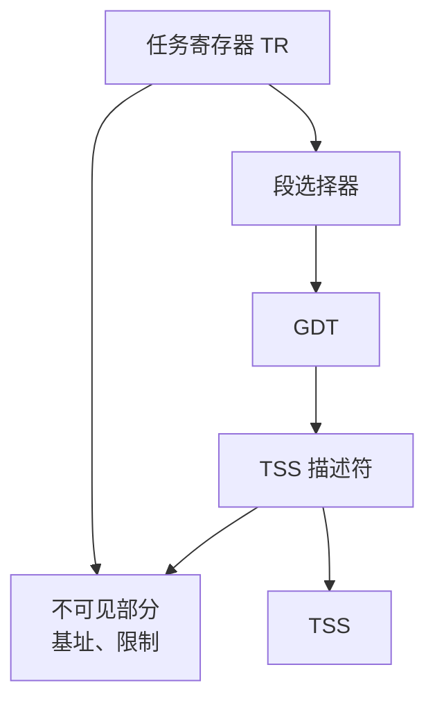
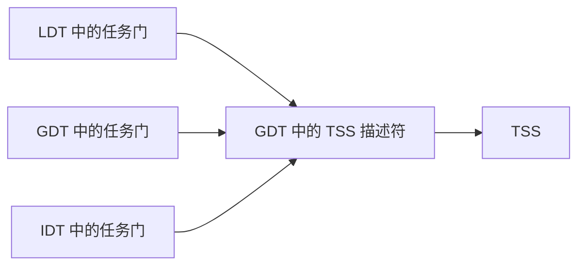
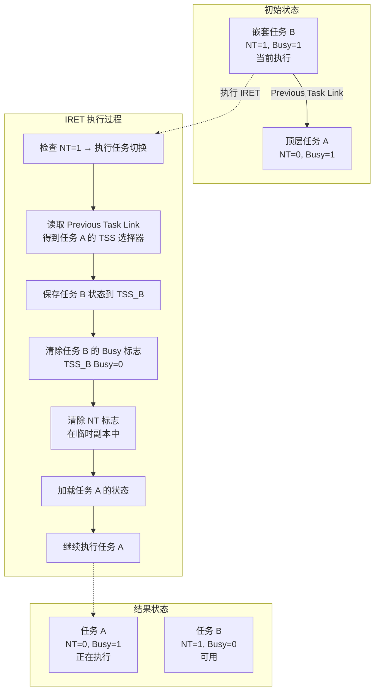
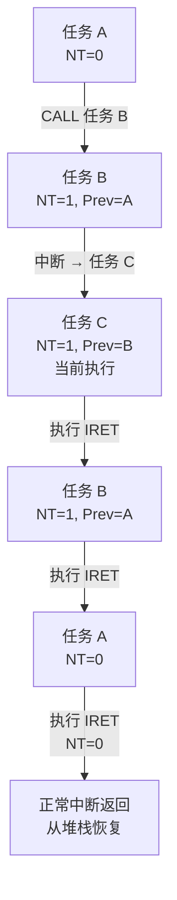
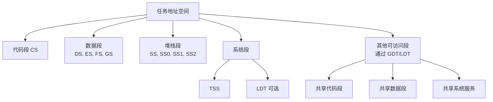
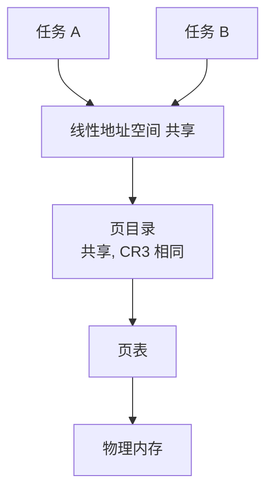
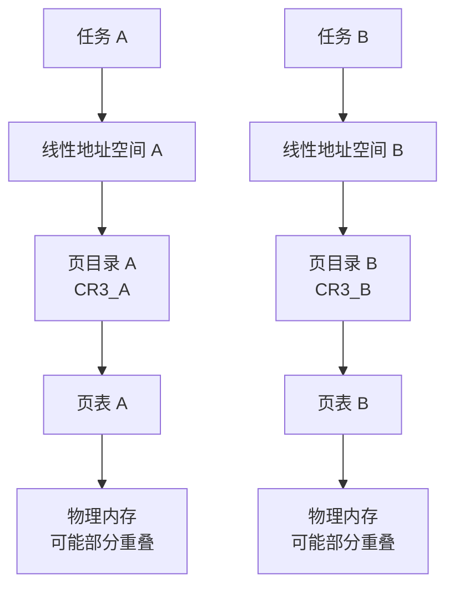
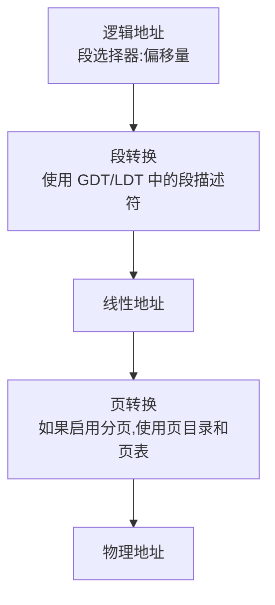
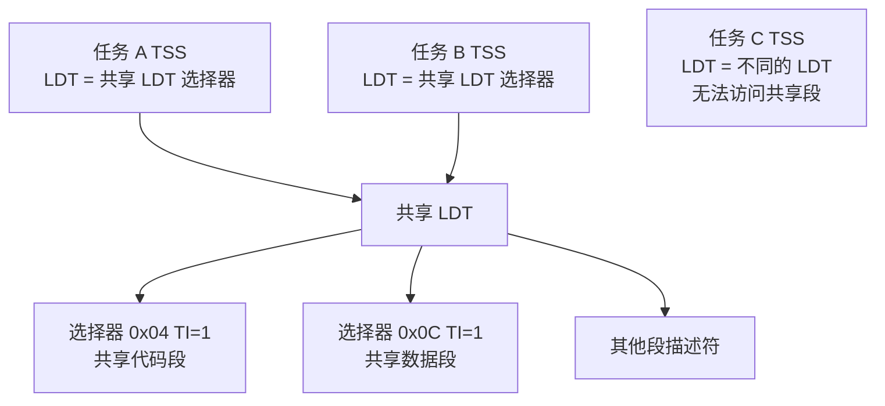

# Chapter 7 任务管理 - 读书笔记

## 4.1. 任务管理概述

### 基本概念

**什么是任务？**

任务(Task)是处理器可以调度(dispatch)、执行(execute)和暂停(suspend)的工作单元。它可以用于执行以下内容：
- 程序
- 任务或进程
- 操作系统服务实用程序
- 中断或异常处理程序
- 内核或执行实用程序

在保护模式下运行时,所有处理器执行都在任务内进行。即使是简单的系统也必须至少定义一个任务。更复杂的系统可以使用处理器的任务管理功能来支持多任务应用程序。

**80x86 提供了哪些硬件支持？**

IA-32 架构提供了以下硬件支持机制：
1. **任务状态保存机制**：用于保存任务的完整执行状态
2. **任务调度机制**：用于调度任务执行
3. **任务切换机制**：用于从一个任务切换到另一个任务
4. **任务保护机制**：通过特权级和地址空间隔离提供任务间保护
5. **任务链接机制**：用于在多任务系统中链接任务

**描述符表中与任务相关的描述符有哪些？**

与任务相关的描述符包括：
1. **TSS 描述符(TSS Descriptor)**：
   - 位于 GDT 中
   - 描述任务状态段的位置和属性
   - 包含 Busy 标志用于防止递归任务切换
   - Type 字段：1001B(不忙)或 1011B(忙)

2. **任务门描述符(Task-Gate Descriptor)**：
   - 可以位于 GDT、LDT 或 IDT 中
   - 提供对任务的间接、受保护引用
   - 包含指向 TSS 描述符的段选择器
   - Type 字段：0101B

**任务切换与过程调用的区别是什么？**

| 特性 | 任务切换 | 过程调用 |
|------|----------|----------|
| **状态保存范围** | 保存完整的任务状态到 TSS(所有寄存器、段选择器、EFLAGS、EIP、CR3 等) | 仅保存返回地址和必要的寄存器到栈 |
| **地址空间** | 可以切换到不同的地址空间(不同的 LDT 和页表) | 在同一地址空间内执行 |
| **特权级变化** | 新任务以其 CS.CPL 指定的特权级开始执行,不继承旧任务的特权级 | 可能发生特权级转换,但遵循调用门规则 |
| **保护检查** | 通过 TSS 描述符和任务门的隔离和特权规则控制 | 通过调用门和段选择器的特权规则控制 |
| **硬件开销** | 较大,需要读写 TSS、更新多个寄存器 | 较小,主要是栈操作 |
| **嵌套支持** | 通过 NT 标志和 Previous Task Link 支持 | 通过栈的嵌套调用帧支持 |

### 4.1.1. 任务的结构

**一个任务由几部分构成？**

任务由两个主要部分组成：

1. **任务执行空间(Task Execution Space)**
2. **任务状态段(Task-State Segment, TSS)**

**任务执行空间包括什么？**

任务执行空间包括以下段：
- **代码段(Code Segment)**：存放任务的程序代码
- **堆栈段(Stack Segment)**：存放任务的堆栈数据
- **一个或多个数据段(Data Segments)**：存放任务的数据

如果操作系统使用处理器的特权级保护机制,任务执行空间还包括：
- **特权级 0 的堆栈段**
- **特权级 1 的堆栈段**
- **特权级 2 的堆栈段**

**为什么会有多个特权级栈空间？**

多个特权级栈空间的存在是为了支持特权级保护机制：

1. **安全隔离**：
   - 不同特权级的代码使用不同的堆栈,防止低特权级代码访问或破坏高特权级的堆栈数据
   - 每个特权级都有自己独立的堆栈空间

2. **特权级转换**：
   - 当从低特权级调用高特权级代码时(如系统调用),处理器自动切换到高特权级对应的堆栈
   - TSS 中存储了特权级 0、1、2 的堆栈指针(SS0:ESP0、SS1:ESP1、SS2:ESP2)
   - 这确保了高特权级代码在安全的堆栈环境中执行

3. **中断和异常处理**：
   - 当中断或异常发生时,如果需要切换到更高的特权级,处理器会切换到对应的堆栈
   - 这防止了在不可信的用户堆栈上执行关键的系统代码

注意：特权级 3(用户级)的堆栈在任务切换时保存在 SS 和 ESP 字段中。

### 4.1.2. 任务状态

**当前正在执行的任务状态包括哪些内容？**

任务状态包括以下项目：

1. **任务的当前执行空间**：由段寄存器(CS、DS、SS、ES、FS、GS)中的段选择器定义
2. **通用寄存器的状态**：EAX、EBX、ECX、EDX、ESI、EDI、EBP、ESP
3. **EFLAGS 寄存器的状态**：包括标志位和控制位
4. **EIP 寄存器的状态**：指令指针
5. **控制寄存器 CR3 的状态**：页目录基址寄存器(PDBR)
6. **任务寄存器的状态**：指向当前任务的 TSS
7. **LDTR 寄存器的状态**：局部描述符表寄存器
8. **I/O 映射基址和 I/O 映射**：在 TSS 中
9. **特权级 0、1、2 的堆栈指针**：SS0:ESP0、SS1:ESP1、SS2:ESP2,在 TSS 中
10. **指向前一个执行任务的链接**：Previous Task Link,在 TSS 中

**掌握每一个被包含内容的含义**

各状态内容的详细含义：

| 状态内容 | 含义 | 位置 |
|----------|------|------|
| **CS、DS、SS、ES、FS、GS** | 定义任务当前可访问的代码、数据、堆栈段,确定任务的执行环境 | TSS 动态字段 |
| **通用寄存器** | 保存任务的计算状态,包括运算结果、地址计算等 | TSS 动态字段 |
| **EFLAGS** | 包含状态标志(如 ZF、CF)、控制标志(如 DF)和系统标志(如 NT、IOPL) | TSS 动态字段 |
| **EIP** | 指向任务恢复时要执行的下一条指令 | TSS 动态字段 |
| **CR3** | 页目录基址,定义任务的页表结构,实现任务地址空间隔离 | TSS 静态字段 |
| **任务寄存器** | 缓存当前 TSS 的段选择器和描述符,加速任务执行 | 处理器寄存器 |
| **LDTR** | 指向任务的局部描述符表,只有段选择器在 TSS 中 | TSS 静态字段(仅选择器) |
| **I/O 映射** | 控制任务对 I/O 端口的访问权限 | TSS 静态字段 |
| **特权级堆栈指针** | 用于特权级转换时切换堆栈,保证安全性 | TSS 静态字段 |
| **Previous Task Link** | 指向前一个任务的 TSS 段选择器,用于嵌套任务返回 | TSS 动态字段 |

**为什么要包含这些内容？**

包含这些内容的原因：

1. **完整状态保存**：
   - 这些内容完整描述了处理器的执行状态
   - 能够精确地暂停和恢复任务的执行
   - 确保任务恢复后可以从中断点继续正确执行

2. **任务隔离**：
   - CR3 允许每个任务有独立的页表,实现内存隔离
   - LDTR 允许每个任务有独立的 LDT,实现段级别的隔离
   - I/O 映射控制任务的 I/O 访问权限

3. **特权级保护**：
   - 多个特权级的堆栈指针支持安全的特权级转换
   - IOPL 和其他标志控制任务的权限

4. **任务链接**：
   - Previous Task Link 和 NT 标志支持任务嵌套
   - 允许从被调用任务返回到调用任务

5. **硬件自动化**：
   - 处理器硬件自动保存和恢复这些状态
   - 减少软件开销,提高任务切换效率

### 4.1.3. 任务的执行

**任务的执行方式有几种？**

软件或处理器可以通过以下 5 种方式调度任务执行：

1. **使用 CALL 指令显式调用任务**
2. **使用 JMP 指令显式跳转到任务**
3. **处理器对中断处理任务的隐式调用**
4. **对异常处理任务的隐式调用**
5. **当 EFLAGS 寄存器中的 NT 标志被设置时使用 IRET 指令返回**

**熟悉掌握每一种执行方式的过程**

**方式 1：CALL 指令调用任务**

过程：
1. CALL 指令的操作数包含段选择器,指向 TSS 描述符或任务门
2. 如果指向任务门,则从任务门中获取 TSS 描述符的选择器
3. 处理器执行特权级检查：CPL 和选择器的 RPL ≤ 目标 DPL
4. 检查目标 TSS 描述符标记为 present 且 limit 有效(≥67H)
5. 检查目标任务不忙(Busy 标志为 0)
6. 保存当前任务状态到当前 TSS
7. 将当前 TSS 的选择器保存到新 TSS 的 Previous Task Link 字段
8. 设置新任务 EFLAGS.NT = 1(标记为嵌套任务)
9. 设置当前任务的 Busy 标志(保持为 1)
10. 设置新任务的 Busy 标志 = 1
11. 加载新任务状态
12. 开始执行新任务

特点：建立嵌套关系,可以用 IRET 返回

**方式 2：JMP 指令跳转到任务**

过程：
1. JMP 指令的操作数包含段选择器,指向 TSS 描述符或任务门
2. 如果指向任务门,则从任务门中获取 TSS 描述符的选择器
3. 执行类似 CALL 的特权级和有效性检查
4. 检查目标任务不忙(Busy 标志为 0)
5. 保存当前任务状态到当前 TSS
6. **清除**当前任务的 Busy 标志(与 CALL 不同)
7. **不修改** Previous Task Link 字段(与 CALL 不同)
8. 新任务的 EFLAGS.NT 从 TSS 加载(与 CALL 不同)
9. 设置新任务的 Busy 标志 = 1
10. 加载新任务状态
11. 开始执行新任务

特点：不建立嵌套关系,旧任务被终止

**方式 3 & 4：中断/异常引起的任务切换**

过程：
1. 中断或异常发生
2. 处理器查找 IDT 中对应的表项
3. 如果 IDT 表项是任务门(而非中断门或陷阱门)：
   - 从任务门获取中断/异常处理任务的 TSS 选择器
   - 不进行 DPL 特权级检查(中断/异常可以切换到任何特权级)
4. 执行类似 CALL 的任务切换过程：
   - 保存当前任务状态
   - 设置 Previous Task Link
   - 设置 NT = 1
   - 保持旧任务 Busy 标志
   - 设置新任务 Busy 标志
5. 加载中断/异常处理任务
6. 开始执行处理任务
7. 处理任务可以使用 IRET 返回到被中断的任务

特点：自动建立嵌套,用于隔离的中断/异常处理

**方式 5：IRET 指令返回**

过程：
1. 执行 IRET 指令
2. 检查当前 EFLAGS.NT 标志
3. 如果 NT = 1(嵌套任务)：
   - 从当前 TSS 的 Previous Task Link 字段获取前一任务的 TSS 选择器
   - 检查前一任务的 TSS 描述符有效
   - 检查前一任务的 Busy 标志必须为 1(IRET 期望它是忙的)
4. 保存当前任务状态到当前 TSS
5. **清除**当前任务的 Busy 标志
6. 在临时保存的 EFLAGS 副本中**清除** NT 标志
7. 加载前一任务的状态(包括已清除 NT 的 EFLAGS)
8. 继续执行前一任务

特点：用于从嵌套任务返回,与 CALL/中断/异常配对使用

注意：如果 NT = 0,IRET 执行正常的中断返回(从堆栈恢复),而不是任务切换。

**Linux 0.00 用的是哪种方式？**

Linux 0.00 主要使用 **JMP 方式进行任务切换**,而不是使用硬件的 CALL/IRET 嵌套机制。

具体来说：
- Linux 0.00 为每个进程定义了 TSS 和 LDT
- 进程切换通过修改 TSS 内容,然后使用 JMP 或 LTR 指令切换到新任务
- **不使用任务嵌套**：不依赖 NT 标志和 Previous Task Link
- **软件调度**：由调度器(schedule 函数)决定切换到哪个任务
- **中断处理**：中断/异常不通过任务门,而是使用中断门/陷阱门,在当前任务上下文中处理

这种方式的优势：
- 更灵活的调度策略
- 避免硬件任务切换的一些限制
- 更好的性能(软件可以优化,只保存/恢复必要的状态)

后续的 Linux 版本完全放弃了硬件任务切换,仅保留一个 TSS 用于特权级转换时的堆栈切换。

**任务可以递归调用吗？为什么？**

**不可以。对于所有 IA-32 处理器,任务不是递归的。任务不能调用或跳转到自身。**

原因：

1. **TSS 只能保存一个任务上下文**：
   - 每个 TSS 只能存储一个任务状态
   - 如果任务递归调用自己,当前状态会被覆盖,导致状态丢失

2. **Busy 标志保护机制**：
   - 当任务被调度执行时,其 TSS 描述符的 Busy 标志被设置为 1
   - 如果尝试切换到一个 Busy 标志已设置的任务,处理器会产生 #GP 异常(通过 CALL/JMP)
   - 这防止了任务切换到自身或任务链中的任何任务

3. **防止状态损坏**：
   - Busy 标志确保在任务链中每个任务只有一个执行实例
   - 这保护了任务的状态信息不被递归调用破坏

4. **异常情况**：
   - 唯一不检查 Busy 标志的情况是 IRET 指令
   - 因为 IRET 期望返回到一个挂起的(因此是 busy 的)任务
   - 但这不是递归,而是返回到调用者

5. **设计哲学**：
   - 硬件任务机制设计用于任务间切换,而非递归
   - 递归应该在任务内部通过正常的过程调用实现
   - 如果需要"递归任务"行为,应该创建多个不同的任务实例

示例说明：
```
任务 A (Busy=1) 尝试 CALL 任务 A
-> 处理器检查目标任务 A 的 Busy 标志 = 1
-> 产生 #GP 异常
-> 任务切换失败
```

## 4.2. 任务的数据结构

处理器定义了五种用于处理任务相关活动的数据结构：

### 任务状态段 (Task-State Segment, TSS)

**32 位 TSS 结构**

TSS 是一个特殊的段,用于保存任务的状态信息。图示结构(地址从低到高)：

```
偏移量    字段名称                    说明
------------------------------------------------------
0x00      Previous Task Link       前一任务的 TSS 选择器
0x04      ESP0                     特权级 0 的栈指针
0x08      SS0                      特权级 0 的栈段选择器
0x0C      ESP1                     特权级 1 的栈指针
0x10      SS1                      特权级 1 的栈段选择器
0x14      ESP2                     特权级 2 的栈指针
0x18      SS2                      特权级 2 的栈段选择器
0x1C      CR3 (PDBR)              页目录基址寄存器
0x20      EIP                      指令指针
0x24      EFLAGS                   标志寄存器
0x28      EAX                      通用寄存器
0x2C      ECX
0x30      EDX
0x34      EBX
0x38      ESP                      当前栈指针
0x3C      EBP
0x40      ESI
0x44      EDI
0x48      ES                       段寄存器
0x4C      CS
0x50      SS
0x54      DS
0x58      FS
0x5C      GS
0x60      LDT Segment Selector     LDT 段选择器
0x64      T flag                   调试陷阱标志(bit 0)
0x66      I/O Map Base Address     I/O 映射基址
```

**字段分类**

**动态字段**(任务切换时由处理器更新)：
- 通用寄存器字段(EAX-EDI)：任务切换前的寄存器状态
- 段选择器字段(ES、CS、SS、DS、FS、GS)：任务切换前的段选择器
- EFLAGS 寄存器字段：任务切换前的标志状态
- EIP 字段：任务切换前的指令指针
- Previous Task Link 字段：包含前一任务的 TSS 段选择器(CALL/中断/异常时更新)

**静态字段**(任务创建时设置,处理器读取但通常不修改)：
- LDT 段选择器字段：任务的 LDT 段选择器
- CR3(PDBR)字段：任务使用的页目录物理基址
- 特权级 0、1、2 堆栈指针字段(SS0:ESP0、SS1:ESP1、SS2:ESP2)
- T(调试陷阱)标志(字节 100,位 0)：设置时,任务切换到此任务会引发调试异常
- I/O 映射基址字段：从 TSS 基址到 I/O 许可位图的 16 位偏移

**重要注意事项**

1. **TSS 最小大小**：
   - 32 位 TSS 的有效段限必须 ≥ 67H(103 字节)
   - 如果包含 I/O 映射,需要更大的限制

2. **分页考虑**：
   - 避免在 TSS 的前 104 字节中放置页边界
   - TSS 的前 104 字节应该在物理上连续
   - TSS 所在页应标记为读/写

3. **每个任务一个 TSS**：
   - 每个任务应该只有一个 TSS
   - 可以有多个任务门指向同一个 TSS

### TSS 描述符

TSS 描述符定义了 TSS 段,格式如下：

```
字节 7-4:  Base 31:24 | G | 0 | 0 | AVL | Limit 19:16 | P | DPL | 0 | B | 0 | 0 | 1 | Base 23:16
字节 3-0:  Base 15:0                     | Limit 15:0
```

**关键字段**：

- **Base(32 位)**：TSS 的线性基址
- **Limit(20 位)**：TSS 的大小,最小为 67H
- **Type(4 位)**：
  - 1001B = 可用的 32 位 TSS
  - 1011B = 忙碌的 32 位 TSS
  - B(busy)位是类型字段的第 2 位
- **DPL(2 位)**：描述符特权级,控制对 TSS 的访问
- **P(1 位)**：段存在标志
- **G(1 位)**：粒度标志
- **AVL(1 位)**：可供系统软件使用

**重要特性**：

1. **只能在 GDT 中**：
   - TSS 描述符只能放在 GDT 中
   - 不能放在 LDT 或 IDT 中
   - 尝试将 TI=1 的选择器用于 TSS 会产生 #GP 或 #TS 异常

2. **Busy 标志**：
   - 指示任务是否正在运行或被挂起
   - 用于防止递归任务切换
   - 每个 TSS 应该只有一个 TSS 描述符指向它

3. **特权级控制**：
   - 任何 CPL ≤ DPL 的程序或过程都可以用 CALL/JMP 调度该任务
   - 大多数系统中 TSS 描述符的 DPL < 3,只有特权软件可以执行任务切换
   - 多任务应用程序中某些 TSS 描述符的 DPL = 3,允许应用级任务切换

### 任务寄存器 (Task Register, TR)

任务寄存器是一个特殊的段寄存器,用于保存当前任务的 TSS 信息。

**结构**：

```
可见部分(16 位):    TSS 段选择器
不可见部分(缓存):   TSS 基址(32 位/64 位)
                   TSS 限制(16 位)
                   TSS 描述符属性
```

**功能**：

1. **可见部分**：
   - 保存当前 TSS 的段选择器
   - 可以通过 STR 指令读取
   - 指向 GDT 中的 TSS 描述符

2. **不可见部分**(由处理器维护)：
   - 缓存 TSS 描述符的内容
   - 包括基址、限制和属性
   - 加速任务执行,避免每次访问 TSS 都要查 GDT

**相关指令**：

**LTR(Load Task Register)**指令：
- 格式：`LTR r/m16`
- 功能：将源操作数(指向 GDT 中 TSS 描述符的段选择器)加载到任务寄存器
- 特权级：CPL = 0(特权指令)
- 用途：系统初始化时设置初始任务
- 操作：
  1. 加载段选择器到 TR 的可见部分
  2. 从 GDT 加载 TSS 描述符到 TR 的不可见部分
  3. 设置 TSS 描述符的 Busy 标志

**STR(Store Task Register)**指令：
- 格式：`STR r/m16`
- 功能：将任务寄存器的可见部分(段选择器)存储到目标操作数
- 特权级：任何特权级都可执行
- 用途：识别当前正在运行的任务
- 操作：将 TR 的段选择器部分复制到指定的寄存器或内存位置

**初始状态**：
- 上电或复位后：selector = 0,base = 0,limit = FFFFH

**访问路径**：



### 任务门描述符 (Task-Gate Descriptor)

任务门提供对任务的间接、受保护引用。

**格式**：

```
字节 7-4:  Reserved | P | DPL | 0 | Type(0101) | Reserved
字节 3-0:  TSS 段选择器 | Reserved
```

**关键字段**：

- **TSS 段选择器(16 位)**：指向 GDT 中的 TSS 描述符(RPL 被忽略)
- **Type(4 位)**：0101B(任务门)
- **DPL(2 位)**：描述符特权级,控制通过此门访问任务的权限
- **P(1 位)**：段存在标志

**位置**：
- 可以放在 GDT 中
- 可以放在 LDT 中
- 可以放在 IDT 中

**访问控制**：

当通过任务门进行任务切换时：
- CPL 和门选择器的 RPL 必须 ≤ 任务门的 DPL
- 目标 TSS 描述符的 DPL 不被使用
- 这允许更灵活的访问控制

**使用场景**：

1. **需要任务只有一个 Busy 标志**：
   - Busy 标志存储在 TSS 描述符中
   - 每个任务应该只有一个 TSS 描述符
   - 可以有多个任务门指向同一个 TSS 描述符

2. **提供对任务的选择性访问**：
   - 任务门可以在 LDT 中,具有与 TSS 描述符不同的 DPL
   - 没有足够特权访问 GDT 中 TSS 描述符(通常 DPL=0)的程序
   - 可以通过具有更高 DPL 的任务门访问任务
   - 给予操作系统更大的灵活性来限制对特定任务的访问

3. **中断或异常由独立任务处理**：
   - 任务门可以放在 IDT 中
   - 允许中断和异常由处理任务处理
   - 当中断或异常向量指向任务门时,处理器切换到指定任务

**示例**：



多个任务门可以引用同一个任务,提供不同的访问路径和权限控制。

### NT 标志(EFLAGS 寄存器中的嵌套任务标志)

虽然不是数据结构,但 NT 标志在任务管理中起关键作用：

- **位置**：EFLAGS 寄存器的第 14 位
- **含义**：
  - NT = 1：当前任务嵌套在另一个任务的执行中
  - NT = 0：当前任务不是嵌套的
- **用途**：
  - 与 Previous Task Link 配合使用
  - IRET 指令检查 NT 标志决定是执行任务切换还是普通返回
- **设置时机**：
  - CALL、中断、异常引起的任务切换设置 NT = 1
  - JMP 引起的任务切换不设置 NT(加载 TSS 中的值)
  - IRET 从嵌套任务返回时清除 NT

## 4.3. 任务切换

### 什么时候发生任务切换？

处理器在以下四种情况下将执行转移到另一个任务：

1. **当前程序、任务或过程执行 JMP 指令,目标是 GDT 中的 TSS 描述符**
   - 直接跳转到新任务
   - 不建立嵌套关系

2. **当前程序、任务或过程执行 JMP 或 CALL 指令,目标是 GDT 或当前 LDT 中的任务门描述符**
   - 通过任务门间接访问任务
   - CALL 建立嵌套关系,JMP 不建立

3. **中断或异常向量指向 IDT 中的任务门描述符**
   - 由中断或异常自动触发
   - 建立嵌套关系
   - 自动返回被中断的任务

4. **当前任务执行 IRET 指令且 EFLAGS 寄存器中的 NT 标志被设置**
   - 从嵌套任务返回到前一任务
   - 使用 Previous Task Link 字段

### 发生任务切换时,处理器会执行哪些操作？

任务切换是一个复杂的过程,包含以下步骤：

**步骤 1：获取新任务的 TSS 段选择器**
- 从 JMP/CALL 指令的操作数获取,或
- 从任务门获取,或
- 从前一任务链接字段获取(IRET)

**步骤 2：检查当前(旧)任务是否允许切换到新任务**
- 对于 JMP 和 CALL 指令,应用数据访问特权规则：
  - 当前任务的 CPL ≤ DPL(TSS 描述符或任务门)
  - 段选择器的 RPL ≤ DPL(TSS 描述符或任务门)
- 对于异常、中断(INT n 除外)和 IRET：允许切换,不考虑 DPL
- 对于 INT n 指令：检查 DPL

**步骤 3：检查新任务的 TSS 描述符**
- 标记为 present(P=1)
- 有效的 limit(≥ 67H)

**步骤 4：检查新任务是否可用**
- 对于 CALL、JMP、异常或中断：新任务必须可用(Busy=0)
- 对于 IRET 返回：新任务必须忙碌(Busy=1)

**步骤 5：检查分页**
- 当前(旧)TSS 的所有页都在内存中
- 新 TSS 的所有页都在内存中
- 任务切换中使用的所有段描述符都已分页到系统内存

**步骤 6：处理旧任务的 Busy 标志**
- 如果由 JMP 或 IRET 发起：**清除**当前(旧)任务 TSS 描述符的 Busy 标志
- 如果由 CALL、异常或中断发起：**保持**Busy 标志设置

**步骤 7：处理 NT 标志(临时副本)**
- 如果由 IRET 发起：在临时保存的 EFLAGS 副本中**清除** NT 标志
- 如果由 CALL、JMP、异常或中断发起：NT 标志保持不变

**步骤 8：保存当前(旧)任务的状态到当前 TSS**
- 处理器从任务寄存器中找到当前 TSS 的基址
- 复制以下寄存器的状态到当前 TSS：
  - 所有通用寄存器(EAX、ECX、EDX、EBX、ESP、EBP、ESI、EDI)
  - 段寄存器的段选择器(ES、CS、SS、DS、FS、GS)
  - 临时保存的 EFLAGS 寄存器副本
  - 指令指针寄存器(EIP)

**步骤 9：设置新任务的 NT 标志**
- 如果由 CALL、异常或中断发起：新任务的 EFLAGS.NT 将被设置为 1
- 如果由 IRET 或 JMP 发起：NT 标志反映从新 TSS 加载的 EFLAGS 中的 NT 状态

**步骤 10：设置新任务的 Busy 标志**
- 如果由 CALL、JMP、异常或中断发起：**设置**新任务 TSS 描述符的 Busy 标志
- 如果由 IRET 发起：Busy 标志保持设置

**步骤 11：将新任务的 TSS 加载到任务寄存器**
- 加载新任务 TSS 的段选择器和描述符到 TR

**步骤 12：从新 TSS 加载状态到处理器(提交点)**
- LDTR 寄存器
- PDBR(控制寄存器 CR3)——如果分页未启用,读取但不加载
- EFLAGS 寄存器
- EIP 寄存器
- 通用寄存器(EAX-EDI)
- 段选择器(ES、CS、SS、DS、FS、GS)

**重要**：如果在此步骤发生故障,可能会损坏架构状态。

**步骤 13：加载和验证段描述符**
- 加载与段选择器关联的段描述符
- 验证段描述符
- 此步骤发生的任何错误都在新任务的上下文中,可能会损坏架构状态

**步骤 14：开始执行新任务**
- 从新加载的 EIP 开始执行
- 对于异常处理程序,新任务的第一条指令看起来尚未执行

**关键提交点**：

- **步骤 1-11**：如果发生不可恢复错误,处理器不完成任务切换,并确保处理器返回到启动任务切换的指令之前的状态
- **步骤 12**：提交点。如果发生不可恢复错误,架构状态可能已损坏,但会尝试在先前的执行环境中处理错误
- **步骤 13**：提交后。处理器完成任务切换(不执行额外的访问和段可用性检查),并在开始执行新任务之前生成相应的异常
- 如果在提交点之后发生异常,异常处理程序必须在允许处理器开始执行新任务之前自行完成任务切换

**状态保存**：
- 成功的任务切换总是保存当前执行任务的状态
- 如果任务恢复,执行从保存的 EIP 值指向的指令开始,寄存器恢复到任务挂起时的值

**特权级变化**：
- 切换任务时,新任务的特权级不继承挂起任务的特权级
- 新任务以 CS 寄存器 CPL 字段指定的特权级开始执行,该字段从 TSS 加载
- 由于任务通过各自独立的地址空间和 TSS 隔离,并且特权规则控制对 TSS 的访问,软件不需要对任务切换执行显式特权检查

### 中断或异常向量指向 IDT 表中的中断门或陷阱门,会发生任务切换吗？

**不会发生任务切换。**

详细说明：

**中断门和陷阱门**：
- 当 IDT 表项是**中断门或陷阱门**时：
  - 处理器在**当前任务的上下文中**处理中断或异常
  - 不发生任务切换
  - 处理器执行以下操作：
    1. 如果需要,进行特权级转换(切换到更高特权级的堆栈)
    2. 将 EFLAGS、CS、EIP 压入堆栈
    3. 如果有错误码,也压入堆栈
    4. 跳转到中断/异常处理程序(通过门描述符中的段选择器和偏移量)
  - 处理程序使用 IRET 返回时,从堆栈恢复 EFLAGS、CS、EIP

**任务门**：
- 当 IDT 表项是**任务门**时：
  - 处理器执行任务切换
  - 切换到专门的中断/异常处理任务
  - 处理器执行完整的任务切换过程(保存当前任务状态,加载新任务状态)
  - 处理任务使用 IRET(NT=1)返回时,切换回被中断的任务

**区别总结**：

| 特性 | 中断门/陷阱门 | 任务门 |
|------|---------------|--------|
| **任务切换** | 否 | 是 |
| **状态保存位置** | 当前任务的堆栈 | 当前任务的 TSS |
| **处理程序上下文** | 当前任务 | 独立的处理任务 |
| **地址空间** | 共享(可能切换到内核地址空间) | 独立(处理任务有自己的 LDT/页表) |
| **返回方式** | IRET(从堆栈恢复) | IRET(任务切换) |
| **隔离性** | 低(共享地址空间) | 高(完全隔离) |
| **性能** | 快(只需堆栈操作) | 慢(完整任务切换) |

**实际使用**：

现代操作系统(包括 Linux、Windows)通常使用**中断门/陷阱门**而非任务门：
- 性能更好
- 更灵活(软件可以控制上下文保存)
- 避免硬件任务切换的复杂性

任务门主要用于：
- 需要完全隔离的关键异常处理(如双重故障)
- 教学目的
- 某些实时系统需要严格隔离时

## 4.4. 任务链

任务链(Task Linking)是指通过 Previous Task Link 字段和 NT 标志实现的任务嵌套机制。

### 如何判断任务是否嵌套？

通过 **EFLAGS 寄存器中的 NT(Nested Task)标志** 判断：

- **NT = 1**：当前执行的任务嵌套在另一个任务的执行中
- **NT = 0**：当前任务不是嵌套的,是顶层任务

```
示例：
任务 A (NT=0) CALL 任务 B
  -> 任务 B (NT=1) 中断 -> 任务 C
    -> 任务 C (NT=1) 执行中 <-- NT=1 表示嵌套
```

### 什么情况会发生任务嵌套？

任务嵌套在以下情况下发生：

**1. CALL 指令引起的任务切换**
```
任务 A 执行: CALL TSS_B_Selector
结果：
  - 任务 A 挂起,状态保存到 TSS_A
  - 任务 B 的 Previous Task Link = TSS_A 的选择器
  - 任务 B 的 NT = 1
  - 任务 A 的 Busy 标志保持为 1
  - 任务 B 开始执行
```

**2. 中断引起的任务切换**
```
任务 A 执行时发生中断,IDT 表项是任务门
结果：
  - 任务 A 被中断,状态保存到 TSS_A
  - 中断处理任务的 Previous Task Link = TSS_A 的选择器
  - 中断处理任务的 NT = 1
  - 任务 A 的 Busy 标志保持为 1
  - 中断处理任务开始执行
```

**3. 异常引起的任务切换**
```
任务 A 执行时发生异常,IDT 表项是任务门
结果：
  - 任务 A 暂停,状态保存到 TSS_A
  - 异常处理任务的 Previous Task Link = TSS_A 的选择器
  - 异常处理任务的 NT = 1
  - 任务 A 的 Busy 标志保持为 1
  - 异常处理任务开始执行
```

**不发生嵌套的情况：JMP 指令**
```
任务 A 执行: JMP TSS_B_Selector
结果：
  - 任务 A 终止,Busy 标志清除
  - 任务 B 的 Previous Task Link 不被设置
  - 任务 B 的 NT 从 TSS_B 加载(通常为 0)
  - 任务 A 不再可恢复
```

### 任务嵌套时修改了哪些标志位？

**1. NT(Nested Task)标志**
- **位置**：新任务的 EFLAGS 寄存器
- **修改**：设置为 1
- **时机**：在步骤 9(加载新任务状态后)
- **含义**：标记新任务是嵌套任务

**2. Busy 标志**

**旧任务(调用者)的 Busy 标志**：
- **位置**：旧任务 TSS 描述符的 Type 字段
- **修改**：**保持设置**(不清除)
- **时机**：步骤 6
- **含义**：旧任务仍在任务链中,虽然被挂起但仍然"忙碌"

**新任务(被调用者)的 Busy 标志**：
- **位置**：新任务 TSS 描述符的 Type 字段
- **修改**：设置为 1
- **时机**：步骤 10
- **含义**：新任务现在正在执行

**3. Previous Task Link 字段**
- **位置**：新任务 TSS 的偏移量 0x00
- **修改**：存储旧任务 TSS 的段选择器
- **时机**：步骤 8(在保存旧任务状态时)
- **含义**：记录前一个任务,用于返回

**标志位修改总结表**：

| 标志/字段 | 位置 | 操作 | 值 |
|-----------|------|------|-----|
| 新任务 NT | 新任务 EFLAGS | 设置 | 1 |
| 旧任务 Busy | 旧任务 TSS 描述符 | 保持 | 1 |
| 新任务 Busy | 新任务 TSS 描述符 | 设置 | 1 |
| 新任务 Previous Task Link | 新任务 TSS | 加载 | 旧任务 TSS 选择器 |

**示例**：
```
任务切换前：
  任务 A: TSS_A 描述符 Busy=1, 正在执行
  任务 B: TSS_B 描述符 Busy=0, 未执行

任务 A CALL 任务 B 后：
  任务 A: TSS_A 描述符 Busy=1 (保持), 挂起
  任务 B: TSS_B 描述符 Busy=1 (新设置)
          EFLAGS.NT = 1
          Previous Task Link = TSS_A 的选择器
          正在执行
```

### 任务嵌套时,如何返回前一任务？

使用 **IRET 指令** 从嵌套任务返回到前一任务。

**返回过程**：

**步骤 1：执行 IRET 指令**
```assembly
IRET  ; 在嵌套任务中执行
```

**步骤 2：检查 NT 标志**
- 处理器检查当前 EFLAGS.NT
- 如果 NT = 1：执行任务切换(返回前一任务)
- 如果 NT = 0：执行正常的中断返回(从堆栈恢复)

**步骤 3：获取前一任务的 TSS 选择器**
- 从当前 TSS 的 Previous Task Link 字段读取
- 这个字段包含前一任务(调用者)的 TSS 段选择器

**步骤 4：验证前一任务**
- 检查前一任务的 TSS 描述符有效且 present
- 检查前一任务的 Busy 标志**必须为 1**
  - IRET 期望返回到挂起的(因此是 busy 的)任务
  - 如果 Busy=0,产生 #TS 异常

**步骤 5：保存当前任务状态**
- 将当前任务的状态保存到当前 TSS
- 与其他任务切换类似

**步骤 6：清除当前任务的 Busy 标志**
- 当前任务(被调用者)的 TSS 描述符 Busy 标志设置为 0
- 标记当前任务可以再次被调用

**步骤 7：清除 NT 标志**
- 在临时保存的 EFLAGS 副本中清除 NT 标志
- 这个清除后的 EFLAGS 将加载到前一任务

**步骤 8：加载前一任务的状态**
- 从前一任务的 TSS 加载所有寄存器
- 包括已清除 NT 的 EFLAGS(如果前一任务也不是嵌套的)
- 前一任务的 Busy 标志保持为 1

**步骤 9：恢复执行前一任务**
- 从前一任务被挂起的位置继续执行
- EIP 指向 CALL 指令之后的下一条指令

**图示过程**：



**多层嵌套返回示例**：



**注意事项**：

1. **防止虚假任务切换**：
   - NT 标志可以被任何特权级的软件修改
   - 程序可能设置 NT 并执行 IRET,导致随机任务切换
   - 操作系统应将每个创建的 TSS 的 Previous Task Link 初始化为 0
   - 如果发生虚假 IRET,会因无效的 TSS 选择器而产生异常

2. **任务不可递归**：
   - IRET 不检查 Busy 标志(期望它为 1)
   - 其他情况下 Busy 标志防止递归任务切换
   - 确保任务链的完整性

## 4.5. 任务地址空间

### 什么是任务地址空间？

**任务地址空间(Task Address Space)**是指任务可以访问的所有段的集合。

具体包括：
- 任务可以访问的**所有段**
- 这些段通过**段选择器**和**段描述符**定义
- 这些段被映射到处理器的**线性地址空间**
- 线性地址空间进一步映射到**物理地址空间**(直接映射或通过分页)

### 任务地址空间包括什么？

任务地址空间包括以下段：

**1. TSS 中引用的段**：
- **代码段(Code Segment)**：CS 选择器指向
- **堆栈段(Stack Segment)**：SS 选择器指向(多个特权级可能有多个堆栈段)
- **数据段(Data Segments)**：DS、ES、FS、GS 选择器指向

**2. 系统段**：
- **任务状态段(TSS)**：任务自己的 TSS
- **局部描述符表(LDT)**：如果任务有自己的 LDT

**3. 任务代码可以访问的其他段**：
- 通过加载新的段选择器到段寄存器访问的任何段
- 这些段的描述符可以在 GDT 或 LDT 中

**地址空间组成图**：



### 了解把任务映射到线性和物理地址空间的方法

任务到线性和物理地址空间的映射有两种主要方法：

**方法 1：所有任务共享一个线性到物理地址映射**

**不使用分页时**：
- 这是唯一的选择
- 所有线性地址直接映射到相同的物理地址
- 所有任务共享同一个物理地址空间

**使用分页时**：
- 所有任务使用**同一个页目录**
- 所有任务的 TSS 中 CR3 字段指向同一个页目录
- 线性地址空间可以超过可用物理空间(如果支持按需分页虚拟内存)
- 优点：简化内存管理,便于任务间共享
- 缺点：任务间隔离性较弱

**特点**：


**方法 2：每个任务有自己的线性地址空间映射到物理地址空间**

**实现方式**：
- 每个任务使用**不同的页目录**
- 每个任务的 TSS 中 CR3 字段指向不同的页目录
- 任务切换时加载不同的 CR3,切换到不同的页表结构

**映射方式**：
- **完全隔离**：
  - 不同页目录的表项指向不同的页表
  - 不同的页表指向不同的物理页
  - 任务不共享物理地址

- **部分共享**：
  - 某些页目录表项指向相同的页表
  - 这些页表映射到共享的物理页
  - 实现选择性共享(如共享代码、共享系统区域)

**特点**：


**共享区域要求**：

无论使用哪种映射方法,以下区域**必须**在物理空间中所有任务共享：

1. **所有任务的 TSS**：
   - 任务切换时处理器需要读写 TSS
   - TSS 地址的映射在任务切换过程中不能改变
   - 通常放在内核区域,所有任务都映射到同一物理位置

2. **GDT 映射的线性地址空间**：
   - GDT 是全局的,所有任务都需要访问
   - 应该映射到共享的物理区域
   - 否则会违背 GDT 的全局性目的

3. **共享的页表和页目录区域**：
   - 如果任务需要共享某些内存,对应的页表应该可访问

**实现示例**：

**Linux 的做法**：
- 每个进程(任务)有自己的页目录
- 线性地址空间划分：
  - 0x00000000 - 0xBFFFFFFF：用户空间(每个任务不同)
  - 0xC0000000 - 0xFFFFFFFF：内核空间(所有任务共享)
- 内核空间的页目录项在所有任务的页目录中都指向相同的页表
- 这样 TSS、GDT 等系统结构在内核空间中,所有任务都能访问

### 了解任务逻辑地址空间,及如何在任务之间共享数据的方法

**任务逻辑地址空间**是指任务中代码使用的 **逻辑地址(段选择器:偏移量)**。

**地址转换过程**：


**在任务之间共享数据的方法**：

**方法 1：通过 GDT 中的段描述符共享**

**原理**：
- 所有任务都可以访问 GDT
- 在 GDT 中创建指向共享段的段描述符
- 这些段描述符指向映射到公共物理地址区域的线性地址段

**实现**：
1. 在 GDT 中创建共享数据段描述符
2. 该描述符指向线性地址空间中的某个区域
3. 确保该线性地址区域在所有任务的页表中映射到相同的物理内存
4. 所有需要共享的任务加载该段选择器到段寄存器(如 ES)
5. 通过该段寄存器访问共享数据

**示例**：
```assembly
; GDT 中定义共享数据段
SHARED_DATA_SEL equ 0x20

; 任务 A 访问共享数据
mov ax, SHARED_DATA_SEL
mov es, ax
mov dword [es:0], 12345678h  ; 写入共享数据

; 任务 B 访问共享数据
mov ax, SHARED_DATA_SEL
mov es, ax
mov eax, [es:0]  ; 读取任务 A 写入的数据
```

**优点**：
- 所有任务都能访问,真正的全局共享
- 实现简单

**缺点**：
- 缺乏灵活性,所有任务都能看到
- GDT 大小有限(8192 个描述符)

**方法 2：通过共享的 LDT 共享**

**原理**：
- 两个或多个任务的 TSS 中 LDT 字段指向同一个 LDT
- 在共享的 LDT 中创建段描述符,指向共享段
- 这些段映射到公共物理地址区域

**实现**：
1. 创建一个 LDT,包含共享段的描述符
2. 多个任务的 TSS 中 LDT Segment Selector 字段指向该 LDT
3. 任务通过 LDT 中的选择器(TI=1)访问共享段

**示例**：


**优点**：
- 比 GDT 方法更有选择性,可以限制共享范围
- 不消耗 GDT 资源
- 可以创建任务组,组内共享,组外隔离

**缺点**：
- 需要管理多个 LDT
- 共享关系固定在 TSS 创建时

**方法 3：通过不同 LDT 中的别名描述符共享**

**原理**：
- 不同任务有不同的 LDT
- 但是这些 LDT 中的某些段描述符指向相同的线性地址区域
- 这些相同的线性地址区域映射到相同的物理地址
- 这些指向相同内存的不同描述符称为**别名(aliases)**

**实现**：
1. 任务 A 的 LDT 中创建描述符 A,指向线性地址 LA
2. 任务 B 的 LDT 中创建描述符 B,也指向线性地址 LA
3. 确保任务 A 和任务 B 的页表将 LA 映射到相同的物理地址 PA
4. 任务 A 通过描述符 A 访问,任务 B 通过描述符 B 访问,实际访问同一物理内存

**示例**：
```
任务 A LDT:
  选择器 0x04: 基址=0x10000000, 限制=0x1000 → 线性地址 0x10000000-0x10001000

任务 B LDT:
  选择器 0x0C: 基址=0x20000000, 限制=0x1000 → 线性地址 0x20000000-0x20001000

任务 A 页表:
  0x10000000 → 物理地址 0x00500000

任务 B 页表:
  0x20000000 → 物理地址 0x00500000 (相同的物理页)

结果：任务 A 和 B 通过不同的线性地址访问相同的物理内存
```

**优点**：
- 最灵活的共享方法
- 每对任务或任务组可以有不同的共享安排
- 可以精确控制哪些任务共享哪些段
- 其他 LDT 不受影响,完全隔离

**缺点**：
- 实现复杂,需要仔细管理描述符和页表
- 需要更多的内存管理开销

**共享方法比较表**：

| 特性 | GDT 共享 | 共享 LDT | LDT 别名 |
|------|----------|----------|----------|
| **实现复杂度** | 简单 | 中等 | 复杂 |
| **选择性** | 所有任务 | 任务组 | 任意任务对 |
| **灵活性** | 低 | 中 | 高 |
| **资源消耗** | GDT 空间 | LDT 空间 | LDT + 页表 |
| **适用场景** | 全局系统服务 | 任务组协作 | 精确控制共享 |

**实际应用**：

现代操作系统通常：
- 使用方法 1(GDT)共享内核代码和数据
- 使用分页机制(页表级别的共享)而非段级别的共享
- 段机制主要用于兼容性和基本保护
- 通过虚拟内存管理器控制共享和隔离

**安全注意事项**：

使用任何共享方法时要注意：
1. **访问控制**：确保段描述符的 DPL 正确设置
2. **同步**：多个任务访问共享数据需要同步机制(锁、信号量等)
3. **数据一致性**：特别是在多处理器系统中
4. **缓存一致性**：确保页表属性正确(如可缓存性)

## 总结

本报告详细分析了 IA-32 架构的任务管理机制,包括：

1. **任务基本概念**：任务是处理器可以调度、执行和暂停的工作单元,由任务执行空间和 TSS 组成。

2. **任务状态**：包含完整的处理器状态信息,确保任务可以被精确地保存和恢复。

3. **任务执行方式**：通过 CALL、JMP、中断/异常、IRET 五种方式执行,任务不支持递归。

4. **数据结构**：TSS、TSS 描述符、任务寄存器、任务门和 NT 标志共同支持任务管理。

5. **任务切换**：14 步复杂过程,提供完整的状态保存/恢复和保护检查。

6. **任务链**：通过 NT 标志和 Previous Task Link 支持任务嵌套和返回。

7. **地址空间**：支持共享或独立的地址空间,提供多种数据共享方法。

IA-32 的硬件任务管理机制提供了强大的多任务支持,但由于复杂性和性能考虑,现代操作系统通常采用软件任务管理,仅使用部分硬件特性(如 TSS 用于特权级切换的堆栈管理)。
