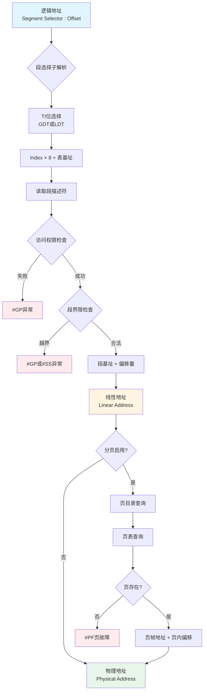
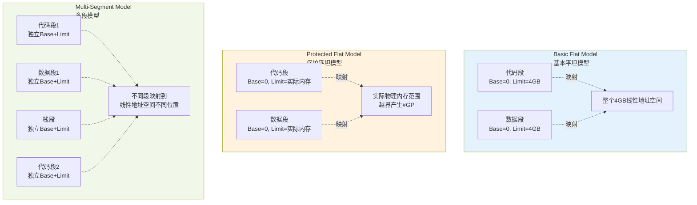

# Chapter 3: 保护模式内存管理 读书笔记

## 2.1 内存管理概览

### 核心概念

IA-32架构的内存管理机制分为两部分：**分段（Segmentation）** 和 **分页（Paging）**

#### 三种地址类型及其转换关系

1. **逻辑地址（Logical Address）**
   - 也称为远指针（Far Pointer）
   - 由两部分组成：
     - 段选择子（Segment Selector）：16位
     - 偏移量（Offset）：32位
   - 这是程序中使用的地址形式

2. **线性地址（Linear Address）**
   - 32位地址，范围：0 到 FFFFFFFFH（4GB）
   - 处理器的线性地址空间是平坦的（未分段的）
   - 通过分段机制将逻辑地址转换为线性地址
   - 转换公式：**线性地址 = 段基址 + 偏移量**

3. **物理地址（Physical Address）**
   - 处理器在地址总线上生成的实际地址
   - 如果不使用分页：线性地址 = 物理地址
   - 如果使用分页：通过页表将线性地址转换为物理地址

#### 地址转换流程

```
逻辑地址（段选择子 + 偏移量）
    ↓ 分段机制
线性地址
    ↓ 分页机制（可选）
物理地址
```

**详细转换流程图**：



### 分段机制的作用

- **隔离性**：将代码、数据、栈模块隔离，使多个程序可以在同一处理器上运行而互不干扰
- **保护性**：
  - 限制段访问范围（段界限检查）
  - 段类型控制（只读、可执行等）
  - 特权级保护（0-3级）
- **必须使用**：在保护模式下，分段机制无法禁用

### 分页机制的作用

- **虚拟内存**：用少量物理内存（RAM/ROM）模拟大的线性地址空间
- **按需加载**：将段分成页（通常4KB），按需在物理内存和磁盘间交换
- **页级保护**：
  - 读写保护
  - 用户/超级用户保护
- **可选使用**：分页机制是可选的

---

## 2.2 分段机制 - 三种分段模型

### 2.2.1 Basic Flat Model（基本平坦模型）

**特点**：
- 最简单的内存模型
- 尽可能隐藏分段机制
- 提供连续、未分段的地址空间

**实现方式**：
- 至少创建两个段描述符：
  - 代码段描述符
  - 数据段描述符
- 两个段的配置：
  - 基址（Base Address）：均为 0
  - 段限（Segment Limit）：均为 4GB
  - 映射到整个线性地址空间

**内存布局**：
- ROM（EPROM）：位于物理地址空间顶部（FFFF_FFF0H附近，处理器复位后从此处开始执行）
- RAM（DRAM）：位于物理地址空间底部（DS段初始基址为0）

### 2.2.2 Protected Flat Model（保护平坦模型）

**特点**：
- 与基本平坦模型类似
- 提供最小级别的硬件保护

**关键区别**：
- 段限设置为**实际物理内存范围**
- 访问不存在的内存会产生**一般保护异常（#GP）**
- 可防止某些程序错误

**增强保护**：
- 定义4个段实现用户/超级用户隔离：
  - 特权级3：用户代码段和数据段
  - 特权级0：超级用户代码段和数据段
- 配合分页机制：
  - 保护操作系统不受应用程序影响
  - 为每个任务/进程提供独立的页表结构
  - 保护应用程序之间互不干扰

### 2.2.3 Multi-Segment Model（多段模型）

**特点**：
- 充分利用分段机制的所有功能
- 提供硬件强制的保护

**实现方式**：
- 每个程序/任务拥有：
  - 自己的段描述符表
  - 自己的段集合
- 段可以是：
  - 完全私有的
  - 程序间共享的

**保护机制**：
- 访问控制：硬件控制所有段的访问
- 边界检查：防止越界访问
- 操作限制：
  - 代码段：只读，不可写
  - 数据段的读写控制
- **保护环（Protection Rings）**：
  - 使用特权级（0-3）保护操作系统过程
  - 防止应用程序未授权访问

**适用场景**：
- 需要健壮保护的多任务环境
- 需要严格隔离代码、数据结构的系统

**三种分段模型对比图**：



**特性对比表**：

| 特性 | Basic Flat | Protected Flat | Multi-Segment |
|------|-----------|----------------|---------------|
| 复杂度 | 最低 | 低 | 高 |
| 保护级别 | 无 | 基本 | 完整 |
| 段数量 | 最少(2个) | 少(2-4个) | 多 |
| 段基址 | 全为0 | 全为0 | 各不相同 |
| 段限制 | 4GB | 实际内存 | 独立设置 |
| 适用场景 | 简单系统 | 单任务保护 | 多任务系统 |

---

## 2.3 逻辑地址到线性地址的转换

### 2.3.1 段选择子（Segment Selector）

**结构**（16位）：
```
15                   3  2  1 0
+--------------------+--+----+
|      Index         |TI|RPL |
+--------------------+--+----+
```

**字段说明**：

1. **Index（索引，位3-15）**
   - 13位，可选择8192个描述符之一
   - 处理器计算：Index × 8 + GDT/LDT基址
   - 8 = 段描述符的字节数

2. **TI（表指示符，位2）**
   - 0：使用GDT（全局描述符表）
   - 1：使用LDT（局部描述符表）

3. **RPL（请求特权级，位0-1）**
   - 范围：0-3（0最高特权）
   - 与CPL（当前特权级）和DPL（描述符特权级）配合使用

**特殊规则**：
- **空选择子**：Index=0 且 TI=0
  - 可以加载到DS、ES、FS、GS（不产生异常）
  - 加载到CS或SS会产生#GP异常
  - 使用空选择子访问内存会产生异常
  - 用途：初始化未使用的段寄存器

### 2.3.2 段寄存器（Segment Registers）

**6个段寄存器**：
- **CS**：代码段寄存器（Code Segment）
- **SS**：栈段寄存器（Stack Segment）
- **DS**：数据段寄存器（Data Segment）
- **ES、FS、GS**：附加数据段寄存器

**结构**：
```
可见部分（Visible Part）: 段选择子
隐藏部分（Hidden Part）: 基址、段限、访问控制信息
```

**隐藏部分（描述符缓存）**：
- 存储从段描述符加载的信息：
  - 段基址（Base Address）
  - 段界限（Segment Limit）
  - 访问权限和类型信息
- **作用**：避免每次访问都读取描述符表，提高性能
- **注意**：多处理器系统中，修改描述符表后需要重新加载段寄存器

**加载方式**：

1. **显式加载指令**：
   - MOV、POP：直接加载段寄存器
   - LDS、LES、LSS、LGS、LFS：加载段选择子和偏移量

2. **隐式加载指令**：
   - CALL、JMP、RET（远调用/跳转版本）
   - IRET、INTn、INTO、INT3
   - SYSENTER、SYSEXIT
   - 这些指令会改变CS（有时也改变其他段寄存器）

### 2.3.3 段描述符（Segment Descriptor）

**结构**（8字节 = 64位）：
```
31        24 23 22 21 20 19    16 15 14 13 12 11     8 7         0
+----------+--+--+--+--+-------+--+-----+--+---------+----------+ +4
|Base 31:24| G|D/|L |A |Limit  | P| DPL |S |  Type   |Base 23:16|
|          |  |B |  |V |19:16  |  |     |  |         |          |
+----------+--+--+--+--+-------+--+-----+--+---------+----------+
31                             16 15                            0
+--------------------------------+------------------------------+ +0
|      Base Address 15:00        |    Segment Limit 15:00       |
+--------------------------------+------------------------------+
```

**关键字段详解**：

1. **段基址（Base Address）**：32位
   - 由三部分组成：Base 31:24、Base 23:16、Base 15:00
   - 指定段在线性地址空间中的起始位置
   - 建议16字节对齐以优化性能

2. **段界限（Segment Limit）**：20位
   - 由两部分组成：Limit 19:16、Limit 15:00
   - 根据G标志有不同解释：
     - G=0：字节粒度，范围 1B - 1MB
     - G=1：4KB粒度，范围 4KB - 4GB
   - **扩展向上段**：有效偏移 0 到 段界限
   - **扩展向下段**：有效偏移 段界限+1 到 FFFFFFFFH（或FFFFH）

3. **Type（类型字段）**：4位
   - 指示段类型和访问权限
   - 解释取决于S标志
   - 详见2.4节

4. **S（描述符类型标志）**：1位
   - 0：系统段描述符
   - 1：代码或数据段描述符

5. **DPL（描述符特权级）**：2位
   - 范围：0-3（0最高特权）
   - 控制段访问权限

6. **P（段存在标志）**：1位
   - 1：段在内存中
   - 0：段不在内存中，访问时产生#NP异常
   - 用于虚拟内存管理

7. **G（粒度标志）**：1位
   - 0：段界限以字节为单位
   - 1：段界限以4KB为单位
   - 不影响基址（始终字节粒度）

8. **D/B（默认操作大小）**：1位
   - 可执行代码段（D标志）：
     - 1：32位地址和操作数
     - 0：16位地址和操作数
   - 栈段（B标志）：
     - 1：使用32位ESP
     - 0：使用16位SP
     - 对扩展向下段，也指定上界
   - 扩展向下数据段（B标志）：
     - 1：上界 FFFFFFFFH（4GB）
     - 0：上界 FFFFH（64KB）

9. **L（64位代码段标志）**：1位
   - IA-32e模式使用
   - 1：64位代码段
   - 0：兼容模式
   - 如果L=1，则D必须=0

10. **AVL（可用位）**：1位
    - 系统软件可用

### 2.3.4 转换过程

处理器执行的步骤：

1. **定位段描述符**
   - 使用段选择子中的TI位选择GDT或LDT
   - 使用Index字段在描述符表中定位描述符
   - 读取描述符到处理器（仅在加载新选择子时）

2. **权限和范围检查**
   - 检查段是否可访问（访问权限）
   - 检查偏移量是否在段界限内

3. **计算线性地址**
   - **线性地址 = 段基址（从描述符）+ 偏移量（从逻辑地址）**

---

## 2.4 描述符的分类

### 2.4.1 代码和数据段描述符

当S标志=1时，描述符为代码或数据段：
- **Bit 11（Type字段最高位）**：
  - 0：数据段
  - 1：代码段

#### 数据段描述符

**Type字段（位8-11）**：
```
11 10(E) 9(W) 8(A)
 0   E    W    A
```

**字段含义**：
- **E（扩展方向）**：
  - 0：扩展向上
  - 1：扩展向下（用于栈）
- **W（写使能）**：
  - 0：只读
  - 1：可读写
- **A（已访问）**：
  - 处理器访问段时自动设置
  - 用于虚拟内存管理和调试

**典型类型**：
- Type=0：只读数据段
- Type=2：可读写数据段
- Type=4：只读扩展向下段
- Type=6：可读写扩展向下段（栈段必须是此类型）

#### 代码段描述符

**Type字段（位8-11）**：
```
11 10(C) 9(R) 8(A)
 1   C    R    A
```

**字段含义**：
- **C（一致性）**：
  - 0：非一致代码段
  - 1：一致代码段
- **R（读使能）**：
  - 0：只执行
  - 1：可执行/可读（用于常量数据）
- **A（已访问）**：同数据段

**一致性代码段**：
- **一致段（C=1）**：
  - 可从低特权级调用
  - 继续以当前特权级执行
  - 用于系统工具和异常处理程序
- **非一致段（C=0）**：
  - 特权级转移需要调用门或任务门
  - 用于需要保护的操作系统过程

**典型类型**：
- Type=8：只执行代码段
- Type=10：可执行/可读代码段
- Type=12：只执行一致代码段
- Type=14：可执行/可读一致代码段

**重要规则**：
- 代码段在保护模式下不可写
- 不能通过CALL/JMP转移到低特权级代码段
- 所有数据段都是非一致的

### 2.4.2 系统段和门描述符

当S标志=0时，描述符为系统描述符。

**系统描述符类型表（32位模式）**：

| Type | 描述符类型 |
|------|----------|
| 0 | 保留 |
| 1 | 16位TSS（可用） |
| 2 | **LDT段描述符** |
| 3 | 16位TSS（忙） |
| 4 | 16位调用门 |
| 5 | **任务门** |
| 6 | 16位中断门 |
| 7 | 16位陷阱门 |
| 8 | 保留 |
| 9 | **32位TSS（可用）** |
| 10 | 保留 |
| 11 | **32位TSS（忙）** |
| 12 | **32位调用门** |
| 13 | 保留 |
| 14 | **32位中断门** |
| 15 | **32位陷阱门** |

#### 1. 局部描述符表描述符（LDT Descriptor）

**Type = 2**

**作用**：
- 定义LDT段的位置和大小
- 必须位于GDT中

**字段**：
- 段基址：指向LDT在线性地址空间的位置
- 段界限：LDT的字节大小
- 相关寄存器：LDTR（存储LDT的选择子、基址、界限）

**使用**：
- 每个LDT需要一个描述符
- 系统可以有多个LDT（如每个任务一个）

#### 2. 任务状态段描述符（TSS Descriptor）

**Type = 9（32位可用）或 11（32位忙）**

**作用**：
- 定义TSS段的位置和大小
- TSS存储任务的状态信息

**状态**：
- 可用（Available）：任务未执行
- 忙（Busy）：任务正在执行或挂起

**IA-32e模式**：
- Type = 9：64位TSS（可用）
- Type = 11：64位TSS（忙）
- 描述符扩展到16字节

#### 3. 调用门描述符（Call Gate Descriptor）

**Type = 12（32位）**

**作用**：
- 提供受保护的跨特权级过程调用
- 允许从低特权级调用高特权级代码

**包含信息**：
- 目标代码段选择子
- 目标过程入口点偏移
- 参数个数
- 特权级信息

#### 4. 中断门描述符（Interrupt Gate Descriptor）

**Type = 14（32位）**

**作用**：
- 位于中断描述符表（IDT）
- 处理硬件中断和异常

**特点**：
- 调用时自动清除IF标志（禁止中断）
- 包含中断处理程序的段选择子和偏移

#### 5. 陷阱门描述符（Trap Gate Descriptor）

**Type = 15（32位）**

**作用**：
- 位于IDT
- 处理软件异常

**与中断门的区别**：
- 不清除IF标志（允许中断嵌套）

#### 6. 任务门描述符（Task Gate Descriptor）

**Type = 5**

**作用**：
- 提供任务切换机制
- 可位于GDT、LDT或IDT

**包含信息**：
- TSS选择子

**用途**：
- 中断/异常引发的任务切换
- 显式任务切换

### 2.4.3 IA-32e模式的变化

**系统描述符扩展**：
- 调用门、IDT门、LDT、TSS描述符扩展到16字节
- 占用两个描述符表项的空间

**64位模式类型**：

| Type | 64位模式描述符 |
|------|--------------|
| 2 | LDT |
| 9 | 64位TSS（可用） |
| 11 | 64位TSS（忙） |
| 12 | 64位调用门 |
| 14 | 64位中断门 |
| 15 | 64位陷阱门 |

---

## 关键要点总结

### 地址转换链

```
逻辑地址 = [段选择子:偏移量]
           ↓
    1. 段选择子 → 定位段描述符（GDT/LDT）
    2. 检查访问权限和段界限
    3. 基址 + 偏移量 → 线性地址
           ↓
线性地址（如果启用分页）
           ↓
    页目录 + 页表 → 物理地址
           ↓
物理地址
```

### 重要概念对比

| 特性 | 分段 | 分页 |
|------|------|------|
| 是否必须 | 必须 | 可选 |
| 粒度 | 可变（1B-4GB） | 固定（4KB） |
| 保护 | 类型、特权级、界限 | 读写、用户/超级用户 |
| 目的 | 逻辑隔离 | 虚拟内存 |

### 描述符表结构

```
GDTR ──→ GDT（全局描述符表）
          ├─ 第0项：空描述符（不使用）
          ├─ 代码段描述符
          ├─ 数据段描述符
          ├─ LDT描述符
          ├─ TSS描述符
          └─ 门描述符

LDTR ──→ LDT（局部描述符表）
          ├─ 任务专用代码段
          ├─ 任务专用数据段
          └─ ...
```

